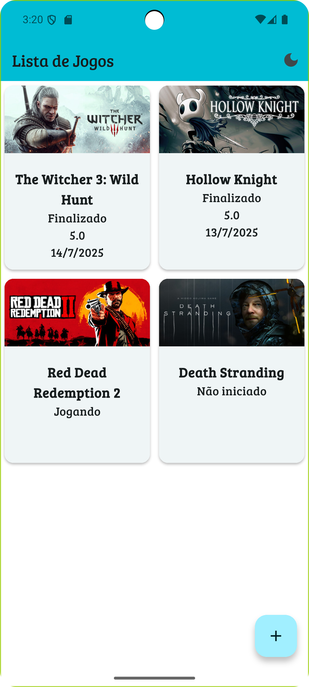
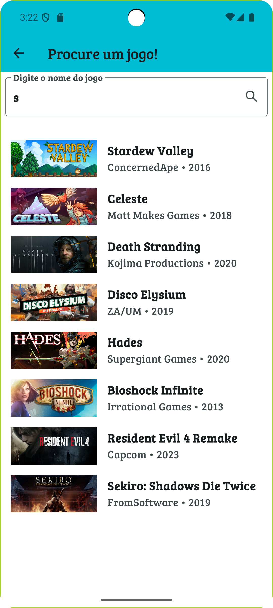
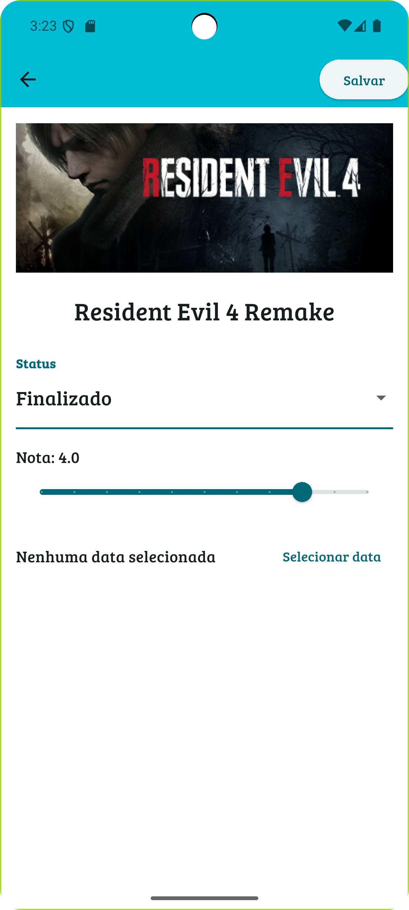
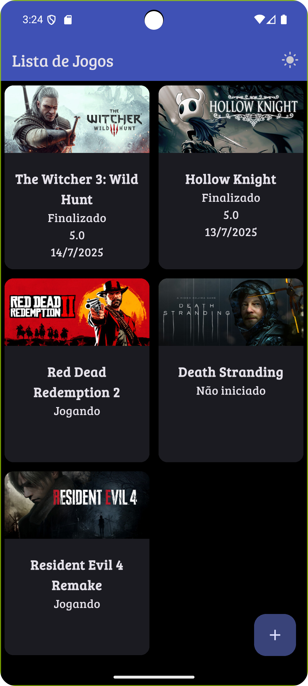

# 🎮 GameTracker

GameTracker is a Flutter app that allows users to search, save, and track their favorite video games. You can mark the status of a game, give it a rating, and choose the date you finished it.

## ✨ Features

- 🔍 Game search simulation with fake API
- 💾 Save games locally using SQLite
- 📝 Track status (Not started, Playing, Finished)
- ⭐ Give a score (0.0 – 5.0)
- 📅 Select the date the game was completed
- 🌓 Light/Dark mode with saved preferences

## 📸 Screenshots







## 🛠️ Technologies Used

- Flutter
- SQFlite (local database)
- Shared Preferences (theme persistence)
- Provider (state management)
- Integration and widget tests

## 🚀 Getting Started

Follow these steps to run the project on your machine:

1. Clone the repository

```bash
git clone https://github.com/nixon-alves/game_tracker.git
cd game_tracker
```

2. Install dependencies

```bash
flutter pub get
```

3. Run the app

```bash
flutter run
```

4. Run the tests
To run unit and widget tests:

```bash
flutter test
```
- To run the integration test:

```bash
flutter test integration_test/
```

## 📄 License

This project is open source and free to use.


